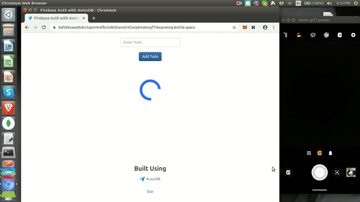

## aviondb-p2p-sync

> A Todo App that can be synced with multiple devices via QR Code

### Demo



### Try it out

Check out the [Todolist sync app in Action](https://bit.ly/aviondb-p2p-sync).

### Requirements

The minimum required version of Node.js is now 8.6.0 due to the usage of `...` spread syntax. LTS versions (even numbered versions 8, 10, etc) are preferred.

### How to Use?

Run the following command to install dependencies & Open the console to see logs

```
npm i
npm start
```
